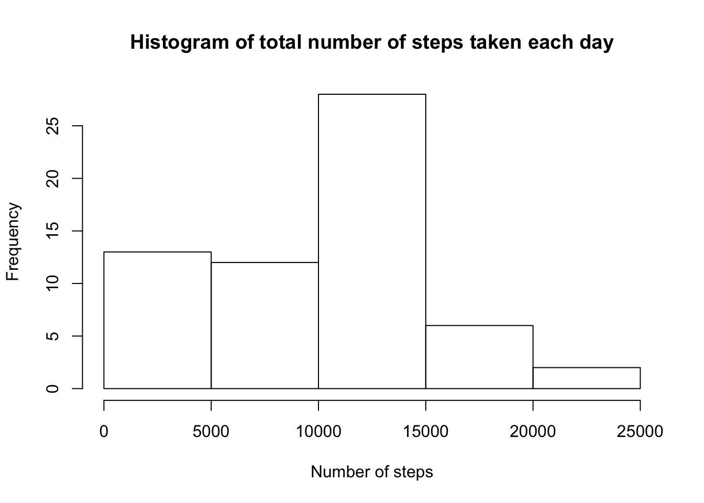
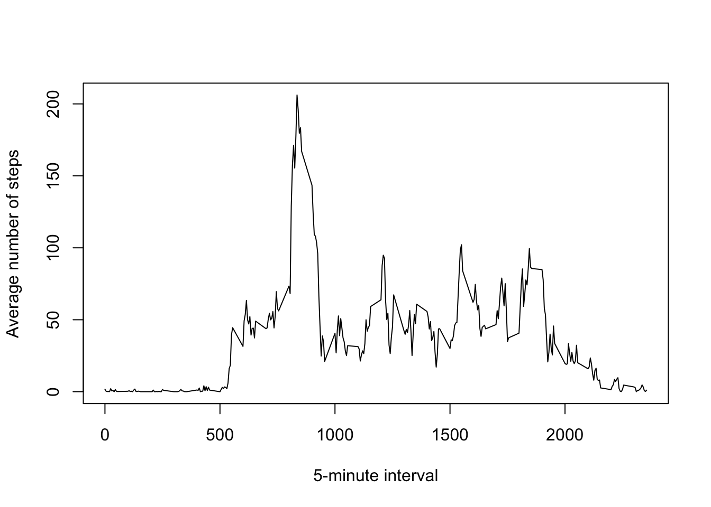
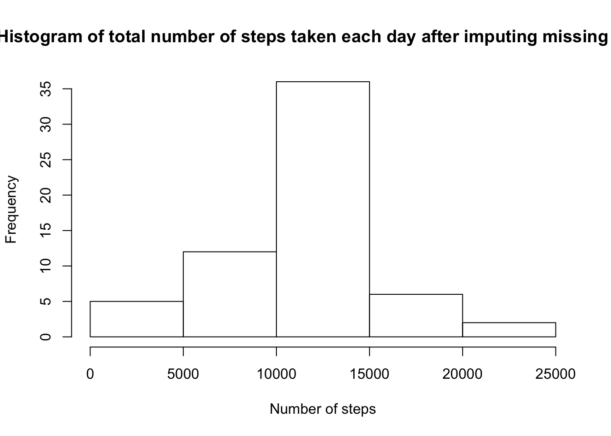
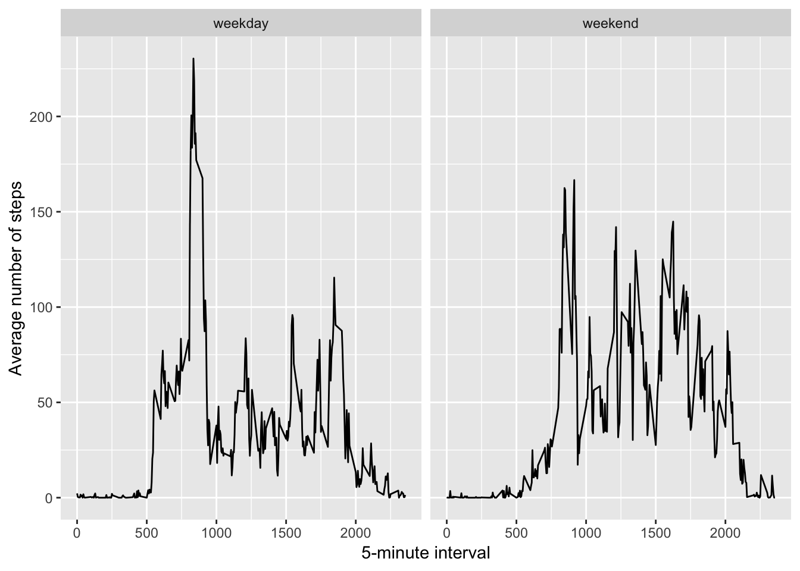

## Unzip and load data


```r
unzip("repdata_data_activity.zip")
data <- read.csv("activity.csv")
```

## Calculate mean total number of steps taken per day

1. Calculate the total number of steps taken per day, with missing values removed from the dataset


```r
library(dplyr)
result1 <- summarise(group_by(data, date), total = sum(steps, na.rm = TRUE))
```

2. Make a histogram of the total number of steps taken each day. 


```r
hist(result1$total, xlab = "Number of steps", main = "Histogram of total number of steps taken each day")
```



3. Calculate the mean and median of the total number of steps taken per day.


```r
mean(result1$total)
```

```
## [1] 9354.23
```

```r
median(result1$total)
```

```
## [1] 10395
```

## Evaluate the average daily activity pattern

1. Calculate the average number of steps taken across all days for each 5-minute interval. 


```r
result2 <- summarize(group_by(data, interval), mean = mean(steps, na.rm = TRUE))
```

2. Make a time series plot with x-axis being the 5-minute interval and y-axis being the average number of steps taken. 


```r
with(result2, plot(interval, mean, type = "l", xlab = "5-minute interval", ylab = "Average number of steps"))
```



3. Report the 5-minute interval which contains the maximum number of steps.


```r
result2[result2$mean == max(result2$mean),]$interval
```

```
## [1] 835
```

## Imputing missing values

1. Calculate the total number of missing values in the dataset.


```r
sum(is.na(data$steps))
```

```
## [1] 2304
```

2 & 3. Create a new dataset that is equal to the original dataset. Use the mean for the corresponding 5-minute interval to replaece the missing value for that interval.


```r
data2 <- data
index <- which(is.na(data2$steps))
for (i in 1:length(index)){
  data2$steps[index[i]] <- result2[result2$interval == data2$interval[index[i]],]$mean
}
```

4. Make a histogram of the total number of steps taken each day.

    Calculate the total number of steps taken per day using new dataset, data2, and make a histogram of the total numbers, and calculate the mean and median. 


```r
result3 <- summarise(group_by(data2, date), total = sum(steps, na.rm = TRUE))

hist(result3$total, xlab = "Number of steps", main = "Histogram of total number of steps taken each day after imputing missing data")
```



```r
mean(result3$total)
```

```
## [1] 10766.19
```

```r
median(result3$total)
```

```
## [1] 10766.19
```

## Are there differenecs in activity patterns between weekdays and weekends?

1. Create a new factor variable in the dataset "data2" with two levels - "weekday" and "weekend". The variable data was converted to date first. 


```r
data2$date <- as.Date(data2$date, "%Y-%m-%d")
for (i in 1:nrow(data2)){
  if (weekdays(data2$date[i]) == "Saturday" | weekdays(data2$date[i]) =="Sunday"){
    data2$day[i] <- "weekend"
  } else {data2$day[i] <- "weekday"}
}

data2$day <- as.factor(data2$day)
```

2. Make a panel plot containing a time series plot of the 5-minute interval and the average number of steps taken on weekdays or weekends. 

    Average the number of steps for each interval for both weekdays and weekends.
    

```r
result4 <- summarize(group_by(data2, interval, day), mean = mean(steps))
```

    Using ggplot2 to plot the time series in two panels. 
    

```r
library(ggplot2)
ggplot(result4, aes(x = interval, y = mean)) + geom_line() + facet_grid(.~ day) + labs(x = "5-minute interval", y = "Average number of steps")
```


